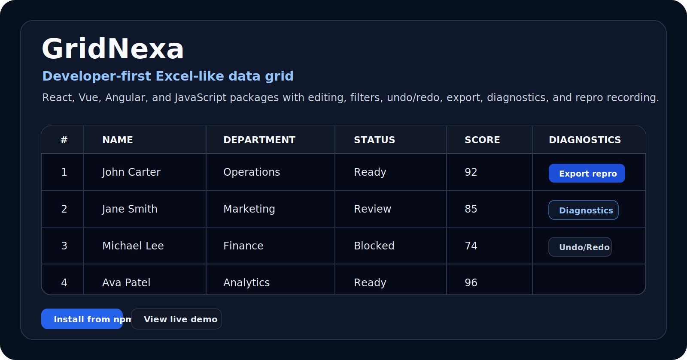
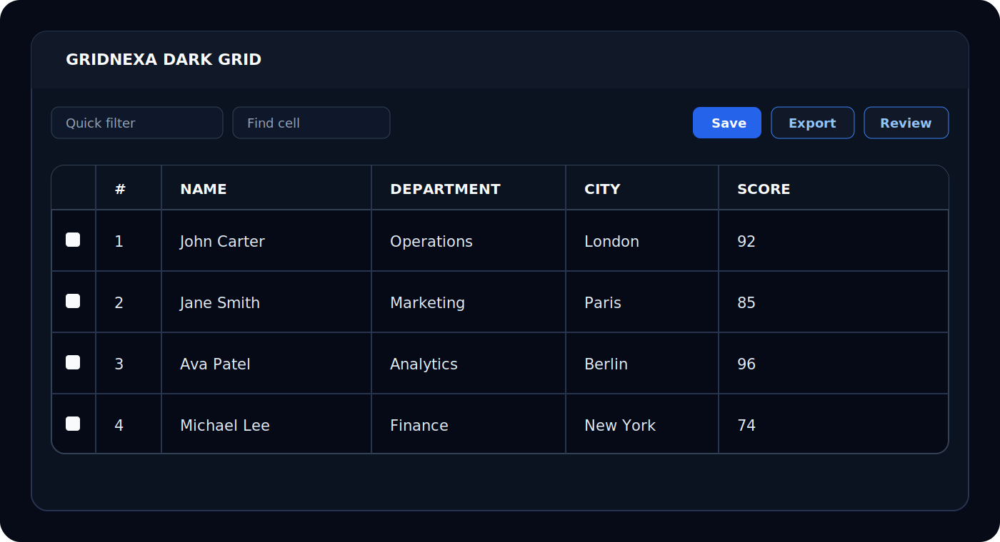

# GridNexa

A feature-rich, Excel-style data grid for React, Vue, Angular, and JavaScript.

GridNexa combines editing, import/export, charts, generated dashboards, filtering, grouping, pivoting, diagnostics, Data Health, Trust Mode, collaboration, saved views, validation, accessibility, and TypeScript-first APIs in packages designed for data-heavy applications.

> GridNexa is distributed through public npm packages. The implementation repository is private while the project is in active development.

## Packages

| Package | Use it for |
| --- | --- |
| [`@gridnexa/react`](https://www.npmjs.com/package/@gridnexa/react) | React applications |
| [`@gridnexa/vue`](https://www.npmjs.com/package/@gridnexa/vue) | Vue 3 applications |
| [`@gridnexa/angular`](https://www.npmjs.com/package/@gridnexa/angular) | Angular applications |
| [`@gridnexa/javascript`](https://www.npmjs.com/package/@gridnexa/javascript) | Framework-free JavaScript/TypeScript |
| [`@gridnexa/core`](https://www.npmjs.com/package/@gridnexa/core) | Shared models, contracts, and tooling |

Current package version: **0.1.19**.

## Install

```bash
pnpm add @gridnexa/react
```

```tsx
import { GridNexa, type Column } from "@gridnexa/react";
import "@gridnexa/react/index.css";

interface Employee {
  id: number;
  name: string;
  department: string;
  score: number;
}

const columns: Column<Employee>[] = [
  { id: "name", field: "name", headerName: "Name", editable: true, filter: "text" },
  { id: "department", field: "department", headerName: "Department", filter: "set" },
  { id: "score", field: "score", headerName: "Score", editable: true, filter: "number" },
];

const rows: Employee[] = [
  { id: 1, name: "John Carter", department: "Operations", score: 92 },
  { id: 2, name: "Alice Moreau", department: "Product", score: 87 },
];

export function EmployeesGrid() {
  return (
    <GridNexa
      columns={columns}
      rows={rows}
      getRowId={(row) => row.id}
      rowNumbers
      checkboxSelection
      enableRangeSelection
      enableFillHandle
      enableUndoRedo
    />
  );
}
```

## Implemented Highlights

- Excel, CSV, TSV, text, and JSON import
- CSV and Excel export
- Range copy/paste, bulk edit, find and replace, fill handle, formulas, undo/redo
- Bar, line, area, pie, donut, scatter, bubble, radar, radial, histogram, box plot, treemap, gauge, funnel, and combo charts with PNG download
- Dashboard Generator with KPI cards, inferred summaries, configured charts, and generated insight notes
- Quick, column, set, number, and advanced filters
- Column resize, reorder, pin/freeze, hide, auto-size, flex, and fill-width layouts
- Grouping, aggregation, pivoting, summaries, tree data, master/detail, and transactions
- Data Health profiling for missing values, duplicates, invalid cells, outliers, completeness, top values, and quality scores
- Trust Mode with active-cell source, validation evidence, downstream-impact preview, edit history, and rollback
- Presets, saved views, persisted UI state, command palette, validation, and change review
- Provider-based realtime cell patches, presence badges, cell locks, and configurable conflict handling
- Diagnostics with repro JSON export and import
- Loading, error, and empty-state overlays
- Provider-neutral AI action plans and server-side operation callbacks
- Nine built-in theme values, density controls, styling tokens and slots, CSS variables, stable classes, custom icons, and unstyled mode
- Per-column header and cell styles plus ellipsis, clip, wrap, tooltip, and line-clamp text controls
- Accessible grid semantics, live announcements, roving cell focus, and comprehensive keyboard navigation

## Dashboard, Trust, And Collaboration

Generate a dashboard from the current visible grid view:

```tsx
<GridNexa
  columns={columns}
  rows={rows}
  toolbar={{ dashboard: true, charts: true, filters: true }}
  dashboard={{ showPanel: true, maxCards: 4, maxRows: 500 }}
/>
```

Help users understand and safely revise the active value:

```tsx
<GridNexa
  columns={columns}
  rows={rows}
  getRowId={(row) => row.id}
  toolbar={{ trustMode: true, dataHealth: true }}
  trustMode={{ showPanel: true }}
  dataHealth
/>
```

Realtime collaboration is provider-neutral. Connect a Socket.IO, WebSocket, Supabase Realtime, Firebase, Yjs, or internal event provider through the `collaboration` prop. GridNexa supports cell changes, presence, cell locks, and conflict modes while preserving application-owned transport and authentication.

## Accessibility And Keyboard Support

GridNexa implements grid, row-group, and grid-cell semantics; row and column indexes; active-cell announcements; and roving focus. Keyboard support includes arrow navigation, Shift+Arrow range extension, Home/End, Ctrl/Cmd+Home/End, Page Up/Down, Enter or F2 to edit, Escape to cancel, and Ctrl/Cmd+C to copy.

## Themes And Styling

Built-in themes are `modern-light`, `modern-dark`, `compact`, `minimal`, `enterprise`, `high-contrast`, `light`, `dark`, and `system`. Use the `styling` prop for typed theme tokens and slot-level styles, or apply `headerStyle`, `cellStyle`, and `textDisplay` per column. See the [React guide](docs/react.md#styling-and-design-systems) for a complete example.

## Documentation

- [Getting started](docs/getting-started.md)
- [React](docs/react.md)
- [Vue](docs/vue.md)
- [Angular](docs/angular.md)
- [JavaScript](docs/javascript.md)
- [Core](docs/core.md)
- [Diagnostics](docs/diagnostics.md)
- [FAQ](docs/faq.md)
- [Comparison](docs/comparison.md)
- [Roadmap](ROADMAP.md)
- [Changelog](CHANGELOG.md)

## Links

- Website: https://www.gridnexa.in/
- Docs and playground: https://www.gridnexa.in/docs/basic-grid
- Help: https://www.gridnexa.in/help

## Feedback

Use GitHub Issues in this public repository for bug reports, feature requests, documentation feedback, and integration questions. Include the package and version, framework version, browser, reproduction steps, and a diagnostics snapshot when possible.

## License

MIT. See [LICENSE.md](LICENSE.md).




